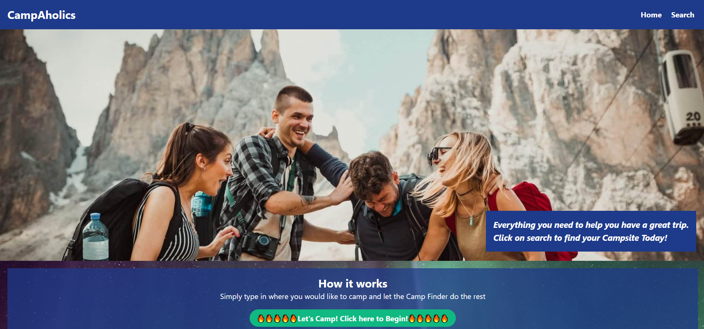
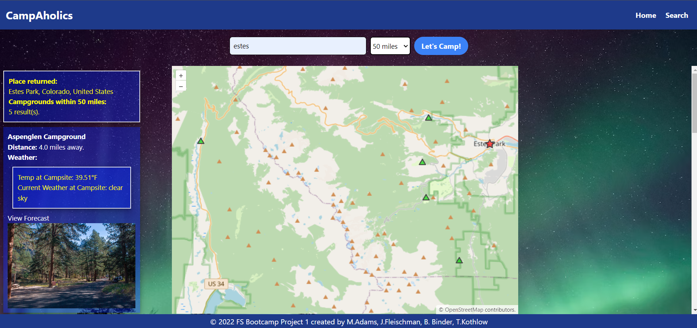

# CampAholics Campsite Finder

## <strong>Description</strong>

For Group Project 1: We are tasked, as a group, to collaborate and create a functional website based on our knowledge learned in class for the past 6 modules

## <strong>Acceptance Criteria</strong>

♦ Use a CSS framework other than Bootstrap.

♦ Be deployed to GitHub Pages.

♦ Be interactive (in other words, accept and respond to user input).

♦ Use at least two server-side APIsLinks to an external site..

♦ Use modals instead of alerts, confirms, or prompts.

♦ Use client-side storage to store persistent data.

♦ Be responsive.

♦ Have a polished UI.

♦ Have a clean repository that meets quality coding standards (file structure, naming conventions, best practices for class/id naming conventions, indentation, quality comments, and so on).

♦ Have a quality README (including a unique name, description, technologies used, screenshot, and link to the deployed application).

## <strong>Presentation Requirements</strong>

♦ Elevator pitch: A one-minute description of your application.

♦ Concept: What is your user story? What was your motivation for development?

♦ Process: What were the technologies used? How were tasks and roles broken down and assigned? What challenges did you encounter? What were your successes?

♦ Demo: Show your stuff!

♦ Directions for future development.

♦ Links to the deployed application and the GitHub repository.

### <strong>Website Link</strong>
https://madams1972.github.io/CampAholics/ 

### <strong>Screenshot</strong>

### <strong>Contact Information</strong>

https://github.com/FleischmanJ88 
https://github.com/tannerkothlow 
https://github.com/binderb 
https://github.com/madams1972
